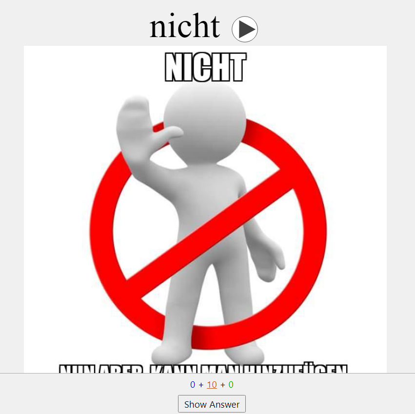
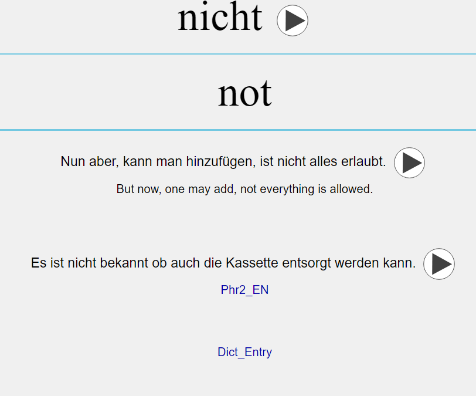
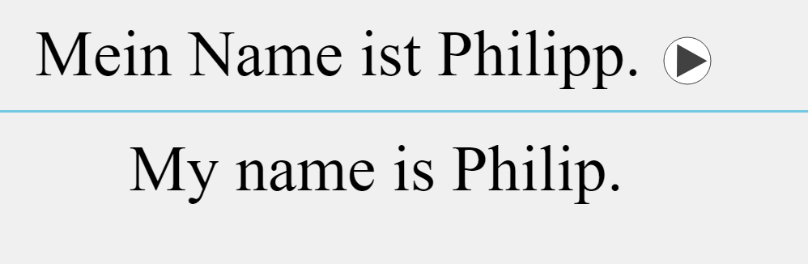

# LangDeckGen

**LangDeckGen** is a Python package for generating Anki decks from word and phrase lists. It enables language learners to create decks using frequency-based word lists and custom phrases, while allowing customization through audio, images, and various formats. 
- The user can specify the source for images (e.g., Bing or Pixabay).
- Images stored locally can also be used locally, and optional meme-style text can be added.
- Audio is generated for both the word and example sentences, with the ability to adjust playback speed.

### How it works:
- **Word and Phrase Translation**: Uses Google Translate (`googletrans`) to translate words and phrases into English, with optional custom translations.
- **Audio Generation**: Supports text-to-speech (TTS) conversion using `gTTS` to create audio for words and sentences. Adjustable speech speed through the `audiospeed` module.
- **Image Integration**: Downloads images related to the words using either the Bing image downloader or the Pixabay API (`pixabay`). Images can be customized with captions or meme-style text overlays via the `meme` module.
- **Sentence Example Retrieval**: Fetches example sentences for the translated word using **Reverso Context**, enhancing language learning by providing contextual usage of words.
- **Meme Creation**: Generates meme-style images using translated phrases or sentences to help with visual association.
- **Dictionary Entry Lookup**: Retrieves dictionary entries from **Reverso Dictionary**, adding definitions and usage explanations to the Anki cards.
- **Error Handling and Customization**: Handles exceptions like missing images or phrases, and provides default placeholders for missing resources.


### Example Code Usage:
This example demonstrates how to generate an AnkiDeck using the `LangDeck` class, as the first example presented on generate_deck.py.
```python
   from LangDeckGen.WordList import WordList
   from LangDeckGen.LangDeck import LangDeck
   # Example 1: Download and process the word list
   # Initialize a WordList object for German, limiting to 25 entries
   myWordList = WordList("de", 25)
   myWordList.downloadWordList()
   myWordList.importWordList(csv_file=myWordList.rawlist)
   # Create a LangDeck object with the specified deck name, WordList, and TTS options
   myLangDeck = LangDeck("GermanA1_Words", myWordList, tts_speed=1.5, PhrasesOnly=False)
```
One can also provide a list of phrases explicitly in the format: `phrase/word; language code; 1`
Such as: `Wie ist dein Name?; de; 1` for a phrase in German.
This is shown in example 2 of generate_deck.py.
You can substitute the number in the last field for a path
to a local image file, or a URL to an image to illustrate the 
card.

## Installation

1. **Clone the repository:**

   ```sh
   git clone https://github.com/rogeriog/LangDeckGenerator.git
   cd LangDeckGen
   ```

2. **Install dependencies using Pipenv:**

   ```sh
   pipenv install
   ```

3. **Activate the virtual environment:**

   ```sh
   pipenv shell
   ```

## Card examples
**Word example**
Front

Back

**Phrase example**
Front-Back


## Contribution

Feel free to contribute to this project by submitting issues, feature requests, or pull requests.

## License

This project is licensed under the MIT License. See the [LICENSE](LICENSE) file for details.
